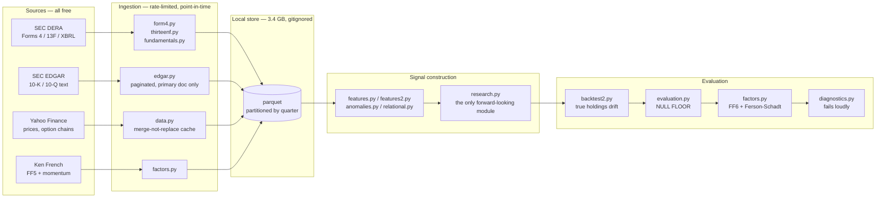

# Systematic Equity Research Framework

A modular harness for ingesting financial data, building cross-sectional signals,
and — the part most backtesting code omits — **establishing whether a result is
distinguishable from noise.**

Twelve signal families were tested across 38 strategies on 211 US large caps over
2005–2026. None beat a random signal routed through the same pipeline, and a
no-signal portfolio outscored all thirty-eight. That negative result is
documented in the whitepaper; this repository is the machinery that produced it and
is reusable for any new signal or universe.

📄 **[Read the whitepaper →](https://aravindvrm.github.io/systematic-equity-research/)**

---

## Pipeline



The ordering matters: **nothing reaches a performance number without passing
through the null floor.** `diagnostics.py` runs on every result and raises a
`FAIL` when a figure sits inside the measured noise band, rather than leaving
that judgement to whoever is reading the output.

---

## The unglamorous problems, and how they are handled

Most of the engineering here is defending against data that is wrong in ways that
still produce plausible numbers.

| problem | what breaks if ignored | handling |
|---|---|---|
| **SEC rate limits** | IP block that looks identical to "this company has no filings" | declared User-Agent, ~8 req/s, exponential backoff on 429/503, 404 distinguished from failure |
| **EDGAR pagination** | the submissions endpoint returns only ~1,000 recent filings inline; older ones live in separate files, so an active filer's history silently truncates to ~2015 | `edgar.filing_index` walks `filings.files` and concatenates |
| **XBRL tag drift** | `Revenues` vs `RevenueFromContractWithCustomerExcludingAssessedTax` vs `SalesRevenueNet` — same concept, different filers and years | alias lists per concept, first available wins |
| **Instants vs durations** | a quarterly income over annual equity is a quarter of the true ROE, silently | balance-sheet items require `qtrs=0`, flows require `qtrs∈{1,4}`, reconciled to TTM before any ratio |
| **Segment rows** | segment and co-registrant rows are *slices* of a company; mixing them with totals corrupts every ratio built from them | consolidated only — `segments` and `coreg` must both be null |
| **Volume** | `num.txt` is ~514 MB per quarter, ~36 GB across 70 | streamed in chunks, filtered to universe CIKs and a tag whitelist, raw download discarded |
| **Point-in-time** | a fiscal quarter ending 31 Dec is not public until filed 30–75 days later; 13F carries a 45-day lag; Form 4 a 2-day lag | everything keys on **filing date**, never period end. Anchoring Form 4 on transaction date produced a signal that vanished once corrected |
| **Cache truncation** | `latest_prices()` refetches ~30 days; a replace-on-write cache overwrote years of history with one month, per ticker, silently | merge-not-replace, with a regression test |
| **Partial ingests** | a missing quarter is indistinguishable from a quarter where nobody filed | ingest scripts exit non-zero and refuse to report success |
| **exFAT volumes** | macOS writes `._` AppleDouble sidecars that match `*.txt.gz` globs and are 4 KB of non-gzip | exact paths, never globs; documented in the notes |

---

## Testing philosophy

**35 tests. Each pins a specific defect that actually occurred.**

This codebase was written with heavy LLM assistance (see the whitepaper's colophon),
which makes a rigorous test harness not optional but the central control. Code
that reads plausibly and computes the wrong thing is the exact failure mode of
accelerated development — and, separately, the exact failure mode of backtesting.
The same discipline answers both.

The tests verify **financial logic**, not just execution:

**Lookahead, with its own control.** `test_lookahead_is_prevented` sets weights
from the return *into* bar *t* — information you only have once *t* has closed.
A naive engine captures every up-move and posts an astronomical Sharpe. Paired
with `test_engine_can_still_profit_from_a_genuine_signal`, which proves the first
test fails for the right reason: the engine rejects future information, not
signal.

**Phantom alpha.**
[`test_random_signals_produce_fake_alpha_through_a_vol_targeted_stack`](tests/test_evaluation.py)
builds a core with volatility clustering, runs a **zero-information** sleeve that
merely de-risks when volatility rises, and asserts it *still* beats its own
beta-matched control. It pins the exact illusion that produced two retracted
conclusions in this project.

**De-risking is not skill.** `test_pure_de_risking_shows_no_genuine_gain` asserts
that a sleeve which is simply 60% of the core plus cash scores ≈ 0 genuine gain
— *while still raising naive standalone Sharpe*. That second clause is the point.

**The framework cannot manufacture alpha.**
`test_adding_the_core_to_itself_adds_nothing` — a sleeve that *is* the core must
contribute exactly zero.

**Silent-corruption regressions.** Cache truncation, `pd.NA` dtype poisoning
(which promotes frames to object and surfaces as an unrelated scipy error), an
all-NaN final bar producing NaN spot prices, and constant-target turnover.

**Metric verification.** Sharpe, drawdown, volatility and CAGR are checked
against `empyrical` to 1e-5. That check found a real defect: Sortino ran 16% high.

```bash
.venv/bin/python -m pytest tests/ -q     # 35 passed
```

---

## Layout

```
algo/        the library
  backtest2.py    engine with true holdings drift
  evaluation.py   NULL FLOOR — the control everything else depends on
  factors.py      Fama-French 6 + Ferson-Schadt conditional attribution
  diagnostics.py  runs automatically; fails loudly
  research.py     the ONLY forward-looking module, deliberately isolated
  edgar.py  form4.py  thirteenf.py  fundamentals.py   ingestion
research/    ~90 one-off analysis scripts, one per question asked
results/     CSV output from the main batteries
notes/       methodology audit, literature review, spec
tests/       35 regression tests
```

Reading order: `backtest2.py` → `evaluation.py` → `factors.py` → `diagnostics.py`.

---

## The finding in three numbers

| | |
|---|---|
| **0.036** | information coefficient required to beat holding everything, long-only |
| **0.012** | best stable IC achievable from free price data on this universe |
| **0.0223** | asymptotic ceiling from the correlation structure of those features |

The organising identity is the Fundamental Law of Active Management,
`IR ≈ IC × √BR × TC` (Grinold 1989; Clarke, de Silva & Thorley 2002). The 0.036
is **measured**, not derived — synthetic forecasts of known IC injected through
the real stack — so it captures this implementation's true transfer coefficient
rather than a textbook value.

**Zero-information signals score FF6 alpha `t = 2.75` on this pipeline.** The
conventional `|t| > 2` bar, and Harvey-Liu-Zhu's `|t| > 3`, are both cleared by
nothing at all. Calibrate against your own pipeline; never quote a bar from
convention.

---

## Running it

```bash
python -m venv .venv && .venv/bin/pip install -e ".[dev]"
.venv/bin/python -m pytest tests/
.venv/bin/python research/reassess_all.py     # every family vs the null floor
```

Ingested data (~3.4 GB) is gitignored and reproducible from `research/ingest_*.py`
and `research/backfill_*.py`. Broker integration is dry-run by default;
`submit_orders()` refuses to send without an explicit `live=True`. Copy
`.env.example` to `.env` for Alpaca paper credentials — `.env` is gitignored.

---

## What it does not claim

Every result is survivorship-biased: the universe is current index membership
carried backward. Fundamentals reach full coverage only from 2012 due to the XBRL
phase-in. Accruals were untestable at 16% cash-flow tag coverage. Spread
estimators are biased upward in level, so only their ratio is used.

Backtested research output on historical data. Not investment advice, and not
achieved returns.
